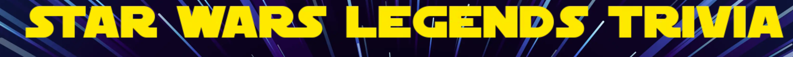

# Star Wars Legends Trivia

Star Wars Legends Trivia is an online quiz for Star Wars fans to test their knowledge of Legends material (previously known as the Expanded Universe, i.e. spinoff books and comics from before the newer Disney movies were released, which are now no longer considered part of the Star Wars canon). The site is targeted towards fans of Star Wars (especially superfans of this more niche part of Star Wars fandom), and fans of trivia games in general. 

The Star Wars Legends Trivia site is a fully responsive website that allows players to answer multiple choice trivia questions on desktop, tablet, or mobile. Players will see their score as they play, and will have the option to replay the trivia game as often as they like. They can also share their results after completing the quiz. Questions are displayed in a random order for replayability. 

Responsive Mockup from [ui.dev](https://ui.dev/amiresponsive):

## Wireframes

Wireframes were created before development, for desktop, tablet, and mobile. This helped to guide design and code structure.

### Desktop Wireframes

### Tablet Wireframes

### Mobile Wireframes

## Features 

### Existing Features

- __The Star Wars Legends Trivia Logo and Heading__

  - The logo functions as a heading describing the purpose of the site (trivia related to Star Wars Legends). Alt text is included for screen readers, and the logo is responsive (changes size and layout depending on the screen size.)
- Logo on Desktop:

- Logo on Mobile:

- __The Instructions Area__

- The instructions area gives the user clear instructions about how to play the game. There is an X in the top right corner to close the instructions when they are no longer needed. 

- __The Game Area__

  -  Questions are displayed in a random order (for replayability), along with 3 answer options in the buttons below. 

- __The Score Area__

  - This section will allow the user to see how many correct answers they have provided, and the number of total questions in the quiz. 

For some/all of your features, you may choose to reference the specific project files that implement them.

In addition, you may also use this section to discuss plans for additional features to be implemented in the future:

### Features Left to Implement

- A high score board, where players can log their score and compare it with other players'. This will require the data to be stored in a database, which is beyond my abilities at this stage, but will be added in the future. 

- Other Star Wars Trivia categories, like: the Original Trilogy, Prequels, Old Republic, and Disney Canon. This will give the player the option of playing multiple different trivia games with different subject matters. 

## Testing 

In this section, you need to convince the assessor that you have conducted enough testing to legitimately believe that the site works well. Essentially, in this part you will want to go over all of your project’s features and ensure that they all work as intended, with the project providing an easy and straightforward way for the users to achieve their goals.

In addition, you should mention in this section how your project looks and works on different browsers and screen sizes.

You should also mention in this section any interesting bugs or problems you discovered during your testing, even if you haven't addressed them yet.

If this section grows too long, you may want to split it off into a separate file and link to it from here.

### Validator Testing 

- HTML
    - No errors were returned when passing through the official [W3C validator](https://validator.w3.org/nu/?doc=https%3A%2F%2Fcode-institute-org.github.io%2Flove-maths%2F)
- CSS
    - No errors were found when passing through the official [(Jigsaw) validator](https://jigsaw.w3.org/css-validator/validator?uri=https%3A%2F%2Fvalidator.w3.org%2Fnu%2F%3Fdoc%3Dhttps%253A%252F%252Fcode-institute-org.github.io%252Flove-maths%252F&profile=css3svg&usermedium=all&warning=1&vextwarning=&lang=en)
- JavaScript
    - No errors were found when passing through the official [Jshint validator](https://jshint.com/)
      - The following metrics were returned: 
      - There are 11 functions in this file.
      - Function with the largest signature takes 2 arguments, while the median is 0.
      - Largest function has 10 statements in it, while the median is 3.
      - The most complex function has a cyclomatic complexity value of 4 while the median is 2.

### Fixed Bugs

- The check answer function was not working correctly because the answers in each button were set to 'text-transform: uppercase', which meant they did not match the text in the array. Removed the text-transform and the function started working correctly.
- The background colour of each button was set to change to red or green if the answer was incorrect (red) or correct (green), but then background colour would stay red or green throughout the next questions. Added an 'onmouseup' event to the 'renderNextQuestion' function that reset the styling to null (CSS default). This resolved the error. Used [this page](https://stackoverflow.com/questions/10698942/how-to-return-a-javascript-set-style-property-to-css-default) on StackOverflow to help troubleshoot.
- The drop shadow that appears on each button on hover was not working if that button was clicked to answer the previous question. Changed CSS style rule that removes the drop shadow from ":focus" to ":active" and this resolved the error, as the button is no longer active after it has been clicked, but it is still in focus. Removed the drop shadow from smaller screen size devices / touch screen devices as the active property stays active after a tap is over.
- The checkAnswer and renderNextQuestion functions were running twice on touch screen devices, due to the screen sometimes reading both 'touchstart' and 'mousedown', and 'touchend' and 'mouseup' events on buttons. Added scripting to detect whether a user is on a touchscreen device, and only running one event listener as relevant.
- The function to tell whether a user was on a touch screen device was also reading my Macbook Air as a touch screen device, which meant the buttons were not working on my laptop (were waiting for touchstart and touchend events, instead of mousedown and mouseup events). I found code on [Codeburst.io](https://codeburst.io/the-only-way-to-detect-touch-with-javascript-7791a3346685) that reads whether a touch event has actually happened, instead of whether a device is touch screen enabled, and this resolved the error. 
- Every time the instructions window was opened by clicking "How to Play", the page reloaded entirely. I used StackOverflow to troubleshoot, and discovered via [this page](https://stackoverflow.com/questions/4823973/javascript-page-reloads-with-eventlistener-click) that this was because the "How to Play" link was empty (a href="") instead of (a href="#").

### Unfixed Bugs

You will need to mention unfixed bugs and why they were not fixed. This section should include shortcomings of the frameworks or technologies used. Although time can be a big variable to consider, paucity of time and difficulty understanding implementation is not a valid reason to leave bugs unfixed. 

## Deployment

This section should describe the process you went through to deploy the project to a hosting platform (e.g. GitHub) 

- The site was deployed to GitHub pages. The steps to deploy are as follows: 
  - In the GitHub repository, navigate to the Settings tab 
  - From the source section drop-down menu, select the Master Branch
  - Once the master branch has been selected, the page will be automatically refreshed with a detailed ribbon display to indicate the successful deployment. 

The live link can be found here - https://code-institute-org.github.io/love-maths/

## Credits 

### Content 

- All trivia questions were written by the developer. Answers were verified for accuracy on [Wookieepedia](https://starwars.fandom.com/wiki/Main_Page)
- The README structure and suggested content was from [Code Institute's Love Maths README template](https://github.com/Code-Institute-Solutions/readme-love-maths/blob/master/README.md).
- This article [CSS-Tricks](https://css-tricks.com/perfect-full-page-background-image/) was used for tips on how to make a full-page background image responsive. 
- [This page](https://www.w3schools.com/howto/howto_css_image_responsive.asp) on W3 Schools was used to learn how to make the logo image responsive.
- [This page](https://stackoverflow.com/questions/5915096/get-a-random-item-from-a-javascript-array) on StackOverflow was used to understand how to select a random object from an array.
- Code Insitutute's [Love Maths Walkthrough](https://learn.codeinstitute.net/courses/course-v1:CodeInstitute+LM101+2021_T1/courseware/2d651bf3f23e48aeb9b9218871912b2e/8775beaed6ed403d92318845af971b30/?child=first) was used for help in connecting event listeners to buttons and for incrementing the score.
- [This code on Hubspot](https://blog.hubspot.com/website/scrolling-text-css) was used to add the scrolling text to the splash page.
- Part of [this code on GeeksforGeeks](https://www.geeksforgeeks.org/how-to-detect-touch-screen-device-using-javascript/?ref=lbp) was used to detect whether a user is on a touch screen device. 
- Part of [this code on codeburst.io](https://codeburst.io/the-only-way-to-detect-touch-with-javascript-7791a3346685) was used to detect whether a touch event has actually happened, and adjust button behaviour accordingly. 
- Code from [CSS-Tricks](https://css-tricks.com/adding-stroke-to-web-text/) was used to add an outline to yellow text.
- I used [this thread](https://stackoverflow.com/questions/400212/how-do-i-copy-to-the-clipboard-in-javascript) on Stack Overflow (and specifically adapted [this response](https://stackoverflow.com/questions/400212/how-do-i-copy-to-the-clipboard-in-javascript) and [this response](https://stackoverflow.com/a/30810322)) to write the shareResults function, allowing the user to copy and paste their results to and from their clipboard.
- [This page on StackOverflow](https://stackoverflow.com/questions/4823973/javascript-page-reloads-with-eventlistener-click) was used to troubleshoot when an empty 'a' element was causing the page to reload every time an event listener was called.

### Media

- The background photo is from [Shutterstock](https://www.shutterstock.com/image-vector/star-warp-hyperspace-jump-traces-moving-1550816240)
- [CloudConvert](https://cloudconvert.com/) was used to convert all images to WEBP format.
- The R2D2 icon used in the Favicon is from [Icon-Icons.com](https://icon-icons.com/download/34499/PNG/512/).
- Lightsaber image in the opening scroll is by Robert W. Schönholz on [Pixabay](https://pixabay.com/users/robertschoenholz-3164230/?utm_source=link-attribution&amp;utm_medium=referral&amp;utm_campaign=image&amp;utm_content=2908144>)
- [Favicon.io](https://favicon.io/) was used to create the favicon. 
- [Google Fonts](https://fonts.google.com/specimen/Oswald) was used for the Oswald font.
- [TinyPNG](https://tinypng.com/) was used to compress images.
- [Pixlr](https://pixlr.com/x/#editor) was used to edit the logo for use on smaller devices. 

## Other General Project Advice

Below you will find a couple of extra tips that may be helpful when completing your project. Remember that each of these projects will become part of your final portfolio so it’s important to allow enough time to showcase your best work! 

- One of the most basic elements of keeping a healthy commit history is with the commit message. When getting started with your project, read through [this article](https://chris.beams.io/posts/git-commit/) by Chris Beams on How to Write  a Git Commit Message 
  - Make sure to keep the messages in the imperative mood 

- When naming the files in your project directory, make sure to consider meaningful naming of files, point to specific names and sections of content.
  - For example, instead of naming an image used ‘image1.png’ consider naming it ‘landing_page_img.png’. This will ensure that there are clear file paths kept. 

- Do some extra research on good and bad coding practices, there are a handful of useful articles to read, consider reviewing the following list when getting started:
  - [Writing Your Best Code](https://learn.shayhowe.com/html-css/writing-your-best-code/)
  - [HTML & CSS Coding Best Practices](https://medium.com/@inceptiondj.info/html-css-coding-best-practice-fadb9870a00f)
  - [Google HTML/CSS Style Guide](https://google.github.io/styleguide/htmlcssguide.html#General)